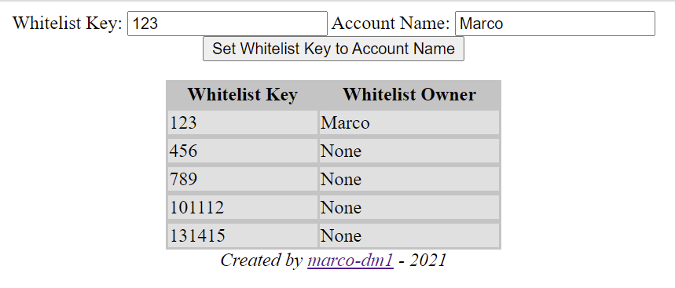

# Node.JS Whitelist Key App

A simple Node app that helps me demonstrate my understanding of NodeJS while additionally learning MongoDB and REST. This project's focus was more on functionality than styling/presentation so the index page only has some basic inline styling to complement it. This was also my first finished Javascript, Node, and MongoDB app.

## How to Run

This app can be ran locally on Windows installations with MongoDB 5.0.1 and NodeJS 14.7.3.

The serverside of the API can be started with the command *node app.js* and the database can be started through the running of the *startDB.bat* batch file. Please note that this respository has excluded the *./DemoData/* mongoDB folder to save Github resources. This can be recreated by creating a directory called *"DemoData"* and having MongoDB create a database inside of it. The database has a single collection called *"whitelists"* and everything in it has two fields: a *key* and an *account*.

## Known Issues

There are a few known issues with this app. The query to pull data from the database happens at the same time as the query to update the database so the index page will often not display the lastest data from the database.

The client doesn't send a request to get the latest data from the database when the javascript file is initalized so the table is empty until an update request is received by the Server and the database data is sent back.

*These issues won't be fixed as I have moved on to other projects.*